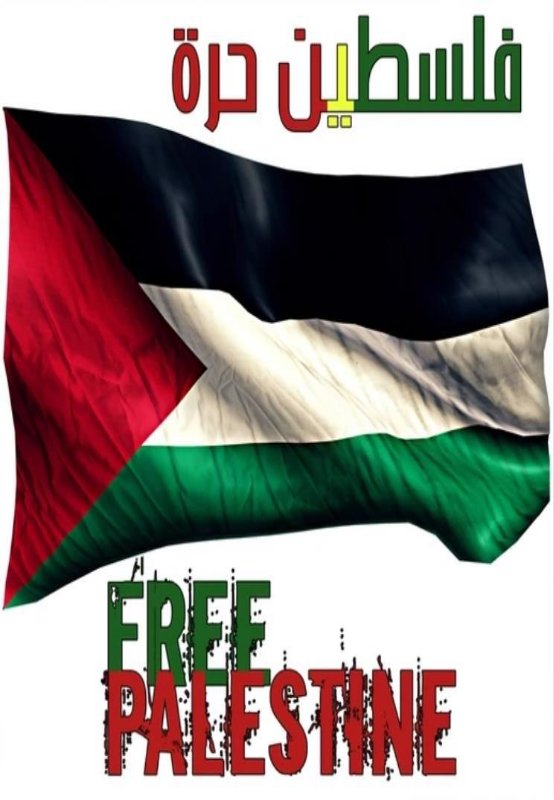

# heartbeat4palestine
# 
# 

For more information contact: ABU OBAIDA.

#SALAM A LKHOUT 3WAXRKOM MBROUKA , LMOHIM MA TDIWX 3LYA 9ALT MAYDAR W SF .

                  l'État de Palestine (arabe : دولة فلسطين, Dawlat Filasṭīn), est un État souverain de jure (loi palestinienne). Située au Moyen-Orient, elle est présente sur les territoires palestiniens occupés et revendique Jérusalem-Est et l'entièreté de la Cisjordanie. Ses frontières sont, de facto et depuis 1994 (accords d'Oslo), celles des zones A et B de la Cisjordanie, gouvernée par l'Autorité palestinienne, et celles de la bande de Gaza, sous contrôle du Hamas depuis 2007 mais revendiquée par l'Autorité palestinienne. Sa capitale est de jure Jérusalem, cependant le siège du gouvernement palestinien se situe à Ramallah en raison de l'annexion de Jérusalem-Est par Israël.

Anciennement intégrée à l'Empire ottoman, puis passée sous mandat britannique après la Première guerre mondiale, elle émerge comme État indépendant à la suite de la guerre israélo-arabe de 1948-1949. La déclaration du 15 novembre 1988 de l'Organisation de libération de la Palestine en exil à Alger a été retenue par l'État de Palestine comme sa déclaration d'indépendance et acceptée comme telle par la Ligue arabe et l'Organisation de la coopération islamique. En 2011, la Palestine adhère à l'UNESCO. Le 29 novembre 2012, l'État de Palestine adhère à l'Organisation des Nations unies (ONU) en tant qu'État observateur non-membre.

Sa souveraineté nationale, sa reconnaissance internationale, ses réfugiés, son territoire et ses frontières, sa capitale même sont l'objet de conflits armés et de débats politiques. En 2017, l'État de Palestine est reconnu par 139 États (72 % des 193 États membres que compte l'Organisation des Nations unies), mais ne l'est pas par les pays d'Amérique du Nord, ainsi que la plupart de l'Europe de l'Ouest, notamment les pays du G7. 


#                                                   PALESTINE

<video width="320" height="240" controls>
  <source src="VID-20240320-WA0099.mov" type="video/mp4">
</video>

                              
                              
                              
![ref1]



[ref1]: Flag_of_Palestine.svg.png
[ref2]: Coat_of_arms_of_Palestine.svg.png

